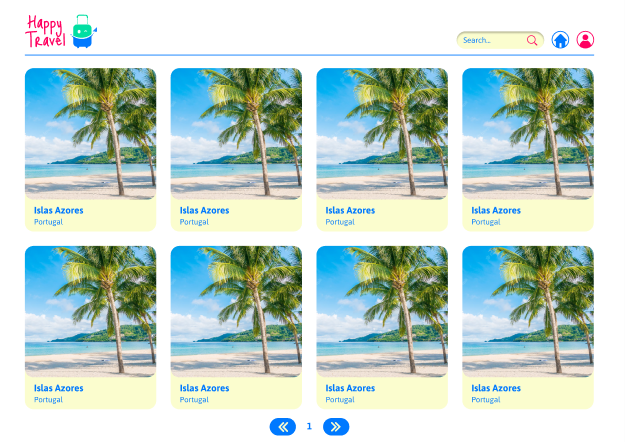
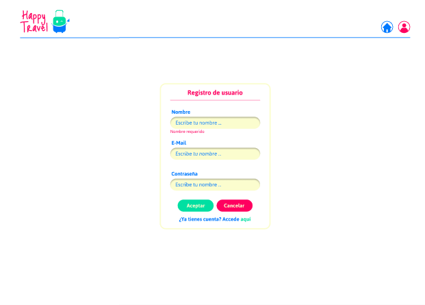
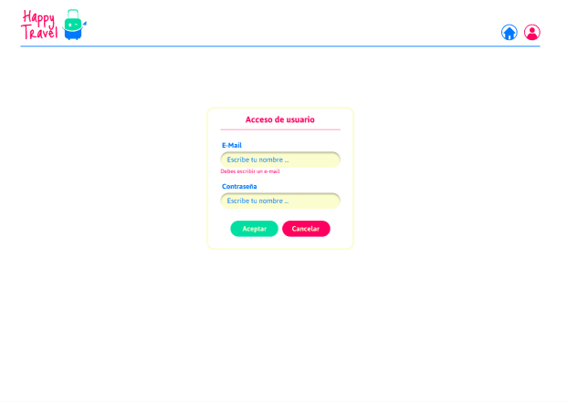
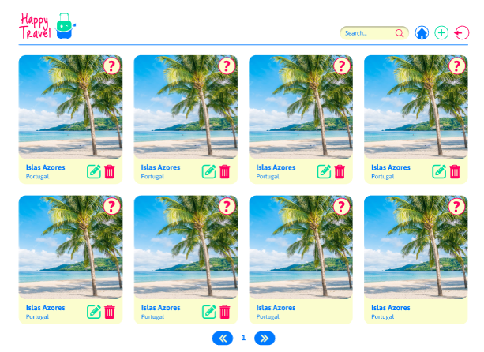
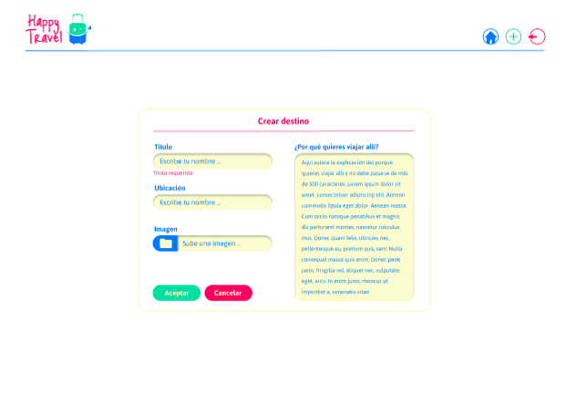
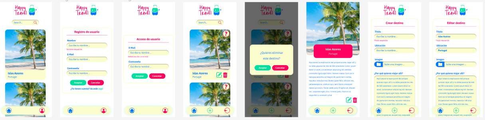

# Project Title Happy Travel 🛫


## OBJECTIVE OF THE PROJECT
🚅 Speaking of Vacations, who doesn't like to travel and see new places? The company HappyTravel has hired them to develop a web application, so that people can tell the destinations they would love to visit and why. The objective is that unauthenticated users can look at all the dream destinations of other users and in turn an authenticated user can create, edit and delete their own travel dreams.


## 📌 Requirements

Visual Studio Code

Node.js installed on the computer
## ⚙️ Installation

This repository is the Frontend where the visual part of the website is, to install it on the computer you must follow these steps:

1- Clone the repository

2- Put in the terminal within the project

npm install

3- To open and see the website in the terminal you have to enter

npm run dev

🚨 This Frontend repository can be used with any Backend, here we leave you the link to the repository of our Backend in case you want to use it with this Frontend 🚨

🔗 [Backend link ](https://github.com/HappyTravel-project/HappyTravel-backend) 🔗


## 🛠️ Tools
- HTML: 5,
- CSS: 3,
- Javascript: "^3.0.5",
- React.js: "^18",
- Jest: "^29.7.0",
- Next: "14.1.0",
- PHP: 8.2.12,
- Axios: "^1.6.7",

## 🧪 Running Tests

To run tests, run the following command

```bash
  npm run test
```


## Screenshots
Desktop 💻











Mobil 📱



FIGMA:   [FIGMA](https://www.figma.com/file/twPJOzEo5hZJZ7srsEt10y/HappyTravel?type=design&node-id=10%3A834&mode=design&t=p3TmznsiCfRll5ue-1)


## 🔗 Information about the programmers ✍️

Hemi:      [linkedin ](https://www.linkedin.com/in/hemileidis/) y
[github ](https://github.com/HemiCastillo)

Fefy:      [linkedin ](https://www.linkedin.com/in/stefania-desogus/) y
[github ](https://github.com/stef-ania)

Steph:      [linkedin ](https://www.linkedin.com/in/stephanie-cespedes/) y
[github ](https://github.com/tephyxp)

Melissa:      [linkedin ](https://www.linkedin.com/in/melissa-casola/) y
[github ](https://github.com/melitacasola)

Carolina:      [linkedin ](https://www.linkedin.com/in/tcarolina/) y
[github ](https://github.com/Thazet)

Grecia:      [linkedin ](https://www.linkedin.com/in/grecialh/) y
[github ](https://github.com/GreciaLH)
